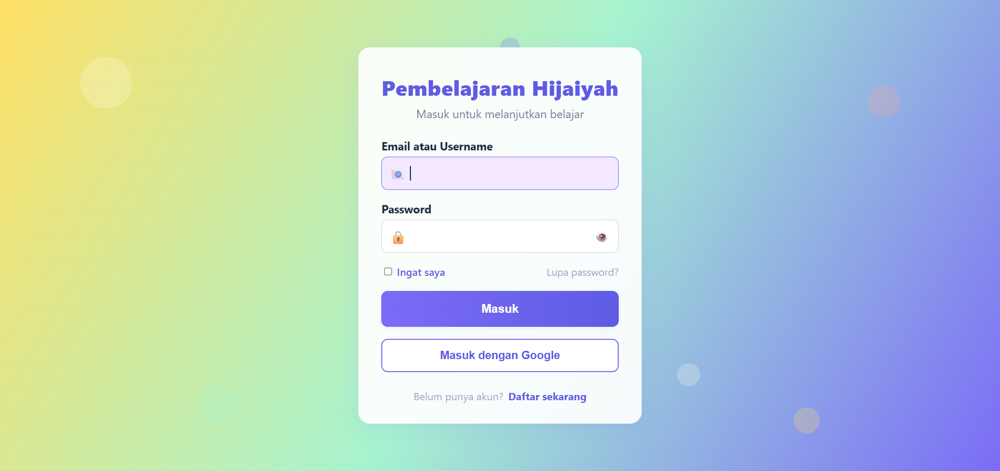
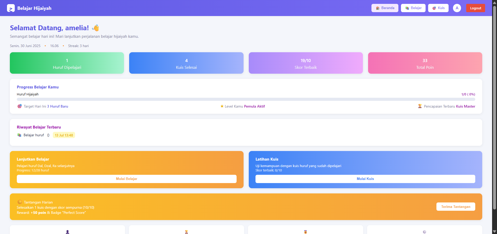
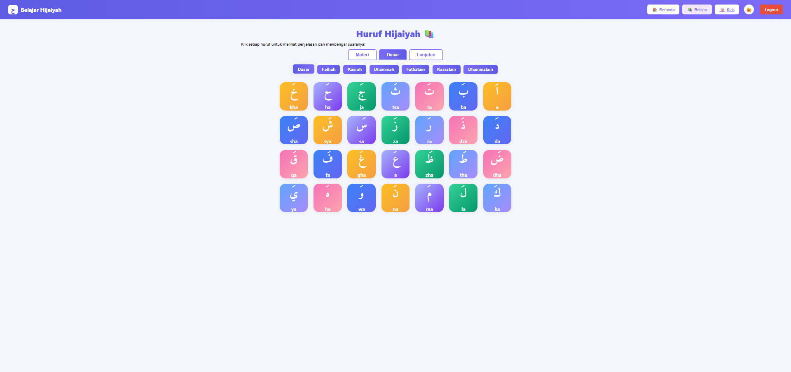
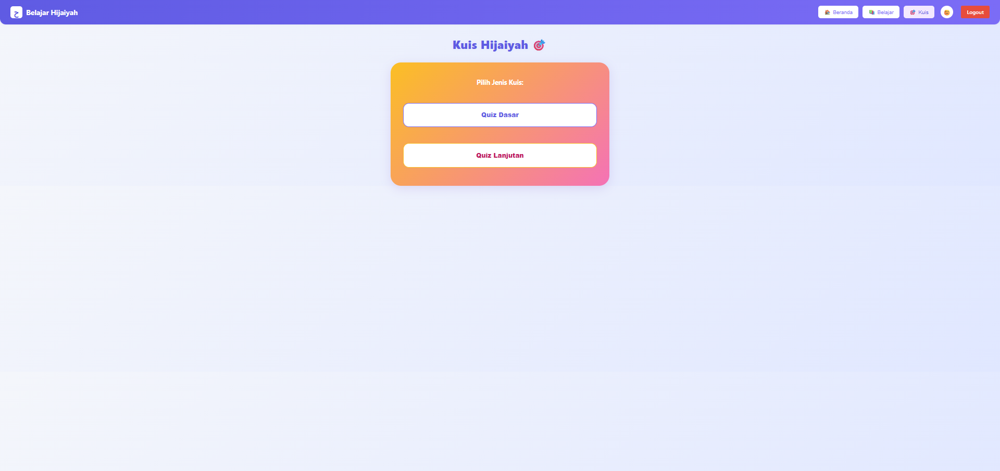
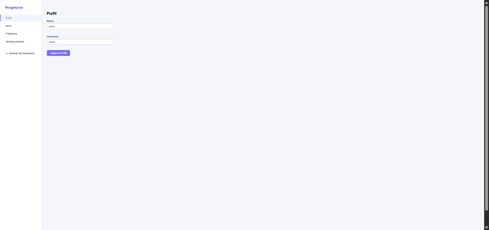
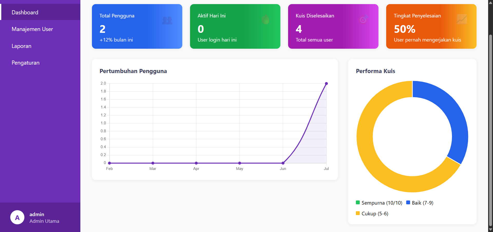

# Belajar Hijaiyah - CodeIgniter

Aplikasi web interaktif untuk belajar huruf Hijaiyah, harakat, tajwid, dan latihan kuis berbasis CodeIgniter 3.

---

## Fitur Utama

- **Belajar Huruf Hijaiyah**: Grid interaktif 28 huruf, klik untuk penjelasan, audio, dan pelafalan sesuai tajwid.
- **Belajar Harakat**: Fathah, Kasrah, Dhammah, Tanwin, dan penjelasan pelafalan standar tajwid.
- **Belajar Lanjutan & Tajwid**: Latihan mad panjang, tasydid, sukun, kalimat pendek, hukum bacaan (Idzhar, Idgham, Iqlab, Ikhfa), dan latihan menulis huruf/kata.
- **Kuis Interaktif**: Kuis nama huruf, pelafalan, jenis harakat, dan tanwin. Skor, riwayat, dan leaderboard.
- **Dashboard User**: Progress belajar, riwayat belajar, pencapaian, badge, tantangan harian, dan leaderboard.
- **Dashboard Admin**: Statistik pengguna, performa kuis, manajemen user, konten pembelajaran, laporan, dan pengaturan sistem.
- **Pengaturan User**: Edit profil, ubah password, hapus akun, preferensi tema (terang/gelap), preferensi bahasa (Indonesia/English), dan info aplikasi.
- **Tema Gelap/Terang**: UI modern, responsif, dan nyaman di semua mode.
- **Skrip Screenshot Otomatis**: `screenshot_all.py` untuk mengambil screenshot otomatis seluruh halaman utama dan materi.

---

## Instalasi & Setup

1. **Kebutuhan Sistem**:
   - PHP >= 5.6 (disarankan 7.x+)
   - MySQL/MariaDB
   - Web server (Apache/Nginx)
   - Composer (opsional, untuk dependency PHP)

2. **Clone Repo**
   ```bash
   git clone <repo-url>
   cd bcit-ci-CodeIgniter-bcb17eb
   ```

3. **Setup Database**
   - Import file `db_hijaiyah.sql` ke MySQL:
     ```bash
     mysql -u <user> -p < db_hijaiyah.sql
     ```
   - Edit `application/config/database.php` sesuai konfigurasi database Anda.

4. **Konfigurasi Aplikasi**
   - Edit `application/config/config.php` (base_url, dll) jika perlu.
   - Pastikan folder `application/cache` dan `application/logs` writable.

5. **Jalankan Aplikasi**
   - Akses di browser: `http://localhost/<folder>/index.php`
   - Default route: halaman login user.

6. **Akun Admin**
   - Buat akun admin dari database atau menu admin (set kolom `role` = 'admin' pada tabel `pengguna`).

---

## Struktur Database

- Tabel utama: `pengguna`, `huruf_hijaiyah`, `belajar_log`, `quiz_log`, `badge`, `user_badge`, `pengaturan`
- Lihat detail di file `db_hijaiyah.sql`

---

## Fitur Lengkap

### User
- Belajar huruf hijaiyah (dasar, harakat, lanjutan)
- Penjelasan, audio, dan pelafalan sesuai tajwid
- Kuis interaktif (nama huruf, pelafalan, harakat, tanwin)
- Progress belajar, riwayat, pencapaian, badge
- Pengaturan profil, password, tema, bahasa, hapus akun
- Tema gelap/terang, UI responsif

### Admin
- Dashboard statistik pengguna & kuis
- Manajemen user, konten pembelajaran, badge
- Laporan aktivitas, hasil kuis, progress belajar
- Pengaturan sistem (site name, max user, maintenance, dsb)

### Lainnya
- **Skrip Screenshot Otomatis**: Jalankan `python screenshot_all.py` untuk screenshot semua halaman utama (butuh Selenium & ChromeDriver)
- **Dukungan Bahasa**: Indonesia & English (pilih di pengaturan user)

---

## Skrip Screenshot Otomatis

- File: `screenshot_all.py`
- Kebutuhan: Python 3, Selenium, ChromeDriver
- Jalankan:
  ```bash
  pip install selenium
  python screenshot_all.py
  ```
- Screenshot akan tersimpan di folder `assets/`

---

## Lisensi

MIT (CodeIgniter) + Custom App (lihat LICENSE)

---

## Kontribusi

Pull request & issue dipersilakan!

---

## Kredit

- Framework: [CodeIgniter 3](https://codeigniter.com/)
- UI: Custom, modern, responsif
- Data & materi: Kemenag RI, Ensiklopedia Islam, Wikipedia, Rumaysho.com 

---

## Contoh Akun User & Admin

| Role  | Username | Password  |
|-------|----------|-----------|
| User  | amelia   | 123456    |
| Admin | admin    | admin123  |

> **Catatan:**
> - Anda bisa membuat akun user baru melalui halaman sign up.
> - Untuk admin, ubah kolom `role` pada tabel `pengguna` menjadi `admin`.

---

## Cara Reset Password

1. Login ke aplikasi sebagai user.
2. Masuk ke menu **Pengaturan > Akun**.
3. Isi password lama, password baru, dan konfirmasi password baru.
4. Klik **Simpan Password**.
5. Jika lupa password dan tidak bisa login, minta admin untuk reset password melalui database.

---

## Penjelasan Fitur Detail

### Fitur User
- **Belajar Huruf**: Klik setiap huruf untuk melihat penjelasan, pelafalan, dan audio.
- **Belajar Harakat**: Fathah, Kasrah, Dhammah, Tanwin, dengan penjelasan tajwid.
- **Belajar Lanjutan**: Latihan mad panjang, tasydid, sukun, kalimat pendek, tajwid dasar, ghunnah, dan latihan menulis.
- **Kuis**: Pilihan mode dasar/lanjutan, skor, riwayat, leaderboard, dan pencapaian badge.
- **Dashboard**: Progress belajar, riwayat belajar, tantangan harian, pencapaian, dan leaderboard.
- **Pengaturan**: Edit profil, ubah password, hapus akun, preferensi tema (terang/gelap), preferensi bahasa (Indonesia/English).

### Fitur Admin
- **Dashboard Admin**: Statistik pengguna, performa kuis, pertumbuhan user.
- **Manajemen User**: Lihat, tambah, hapus user/admin.
- **Konten Pembelajaran**: Tambah/edit huruf hijaiyah, soal kuis, dan materi.
- **Laporan**: Generate dan download laporan aktivitas, progress belajar, hasil kuis.
- **Pengaturan Sistem**: Nama aplikasi, max user, enable registration, maintenance mode.

---

## Screenshot UI

| Login Page | Dashboard User | Belajar Huruf |
|------------|---------------|---------------|
|  |  |  |

| Kuis | Pengaturan User | Dashboard Admin |
|------|-----------------|-----------------|
|  |  |  |

> **Catatan:** Screenshot otomatis dapat diambil dengan menjalankan `python screenshot_all.py`.

---

## Cara Deploy ke Hosting

1. Upload semua file ke hosting (misal: public_html).
2. Edit `application/config/config.php`:
   - Ubah `base_url` ke domain hosting Anda.
3. Edit `application/config/database.php` sesuai database hosting.
4. Import `db_hijaiyah.sql` ke database hosting.
5. Pastikan folder `application/cache` dan `application/logs` writable (CHMOD 755/777).
6. Akses aplikasi via domain Anda.

---

## Struktur Folder

```
├── application/
│   ├── controllers/   # Controller utama (Auth, Dashboard, dsb)
│   ├── models/        # Model database (User_model, Hijaiyah_model, dsb)
│   ├── views/         # Tampilan (dashboard, belajar, kuis, pengaturan, dsb)
│   ├── config/        # Konfigurasi CodeIgniter
│   └── ...
├── assets/            # Hasil screenshot otomatis
├── db_hijaiyah.sql    # Struktur & seed database
├── screenshot_all.py  # Skrip screenshot otomatis
├── index.php          # Bootstrap CodeIgniter
└── ...
```

---

## FAQ (Pertanyaan Umum)

**Q: Bagaimana cara menambah admin baru?**
A: Tambah user baru, lalu ubah kolom `role` di tabel `pengguna` menjadi `admin`.

**Q: Bagaimana jika audio tidak muncul?**
A: Pastikan file audio tersedia dan browser mendukung pemutaran audio.

**Q: Bagaimana mengubah tema/bahasa?**
A: Masuk ke menu Pengaturan > Preferensi, pilih tema dan bahasa, lalu simpan.

**Q: Bagaimana jika lupa password admin?**
A: Reset password langsung di database (update kolom `Password` dengan hash baru).

---

## Kontak & Dukungan

- Email: admin@hijaiyah-app.com
- Telegram: @hijaiyah_support
- Forum: [CodeIgniter Forum](http://forum.codeigniter.com/)

---

## Kontribusi & Pengembangan

- Pull request dan issue sangat diterima!
- Ikuti standar CodeIgniter 3 (MVC), gunakan bahasa yang konsisten (ID/EN).
- Untuk pengembangan, gunakan branch baru dan sertakan deskripsi jelas.

---

## Changelog Singkat

- v1.0.0: Rilis awal, fitur belajar, kuis, dashboard, pengaturan, tema, screenshot otomatis.
- v1.1.0: Penambahan fitur laporan, badge, leaderboard, preferensi bahasa, dark mode.
- v1.2.0: Perbaikan UI, validasi, dan penambahan materi lanjutan & tajwid.

--- 